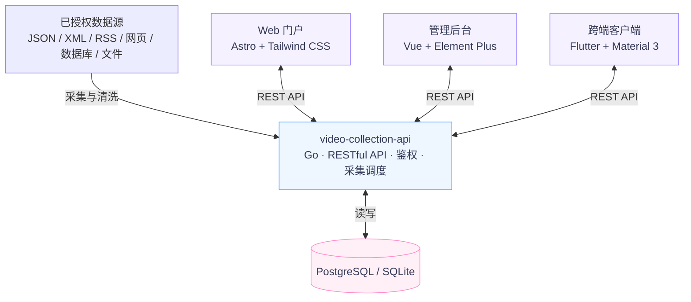
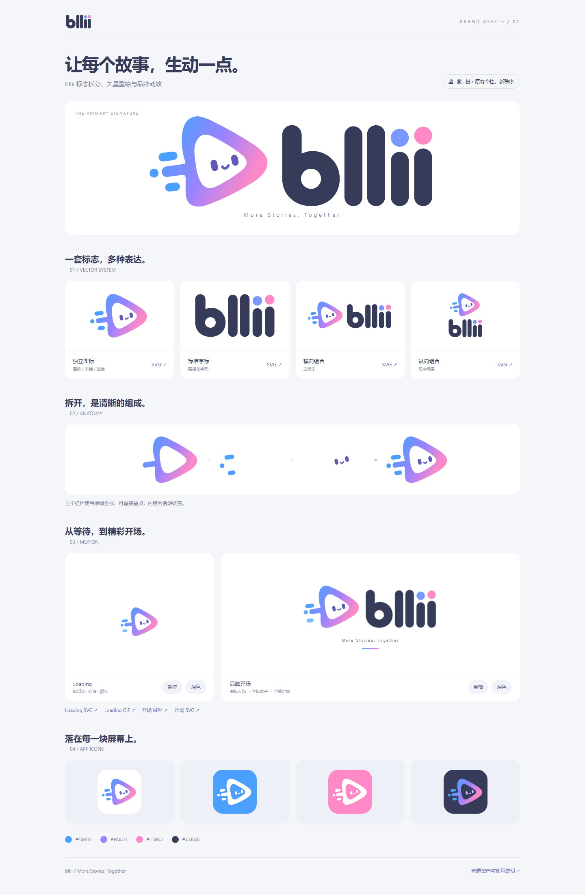

<div align="center">

<picture>
  <source media="(prefers-color-scheme: dark)" srcset="./bllii-brand-kit/png/bllii-horizontal-white.png">
  
</picture>

# Bllii · video-collection

**影视 / 番剧智能采集聚合平台**

从数据采集、内容管理到多端浏览与播放，共享一套 RESTful API。

<p>
  <a href="https://go.dev/"></a>
  <a href="https://astro.build/"></a>
  <a href="https://vuejs.org/"></a>
  <a href="https://flutter.dev/"></a>
  <a href="#系统架构"></a>
</p>

[功能概览](#功能概览) · [快速开始](#快速开始) · [配置指南](#配置指南) · [文档导航](#文档导航) · [品牌资产](#品牌资产)

<sub>More Stories, Together</sub>

</div>

> [!IMPORTANT]
> **本项目仅供个人学习与技术研究使用，不得用于任何商业用途。**
>
> 本仓库只包含源代码、配置示例与品牌素材，**不存储、不提供、不分发任何影视内容**，也不内置任何第三方资源站地址。采集配置中的数据源使用 `example.com` 占位，使用者应仅接入自己拥有版权或已获得合法授权的数据源，并遵守所在地法律法规与相关平台的服务条款。
>
> 因使用、修改或部署本项目产生的任何法律责任由使用者自行承担，与作者无关。若本项目内容侵犯了您的合法权益，请通过 [Issue](https://github.com/plunjoin/video-collection/issues) 联系，我们将及时处理。

## 功能概览

| 能力 | 主要功能 |
| :--- | :--- |
| **多协议采集** | MacCMS JSON、XML、RSS / Atom、自定义 REST JSON；支持影视源增量与全量采集 |
| **采集规则工作台** | 静态网页 CSS、JSON 接口、数据库、Excel / CSV；字段映射、清洗、样本预览与入库 |
| **内容浏览与播放** | 首页推荐、分类筛选、搜索、排行榜、新番时间表、详情、多线路选集与播放 |
| **用户与互动** | 登录注册、追番收藏、观看历史与进度同步；资讯、社区、通用评论及站内通知 API |
| **后台管理** | 采集源、视频库、用户、调度、反馈、站点配置、主题、播放器、日志与数据库管理 |
| **接口与存储** | RESTful API、Cookie / Bearer 鉴权、OpenAPI、Swagger UI、Redoc、RSS 订阅；PostgreSQL / SQLite |

各端的具体实现与配置方式见[子项目文档](#文档导航)。数据库导入支持 PostgreSQL、MySQL、SQLite 和 SQL Server；**平台自身的业务存储使用 PostgreSQL 或 SQLite**。

## 系统架构



- **前后端分离**：门户、后台与客户端独立运行，共用后端数据与接口。
- **本地开发轻量启动**：PostgreSQL 不可用时，API 自动降级到 SQLite；也可显式指定 `DB_DRIVER=sqlite`。
- **接口文档随服务提供**：`/docs`、`/redoc`、`/openapi.json`。

## 仓库结构

| 目录 / 文件 | 职责 | 技术栈 / 用途 |
| :--- | :--- | :--- |
| [`video-collection-api/`](./video-collection-api/) | 采集、检索、鉴权、调度、存储与 API 文档 | Go 1.26 |
| [`video-collection-admin/`](./video-collection-admin/) | 运营与内容管理后台 | Vue 3 · TypeScript · Vite 6 · Element Plus |
| [`video-collection-web/`](./video-collection-web/) | 用户门户与播放页面 | Astro 5 · Tailwind CSS |
| [`video-collection-app/`](./video-collection-app/) | 桌面、移动与 Web 客户端 | Flutter · Material 3 |
| [`bllii-brand-kit/`](./bllii-brand-kit/) | 标志、图标、品牌动画与预览 | SVG · PNG · GIF · MP4 |
| [`run.ps1`](./run.ps1) / [`run.sh`](./run.sh) | 多服务启动器 | Windows PowerShell / Bash |

## 快速开始

### 1. 准备环境

按需要运行的子项目安装工具；仅启动 API、Admin 和 Web 时无需安装 Flutter。

| 工具 | 要求 | 用于 |
| :--- | :--- | :--- |
| [Go](https://go.dev/dl/) | 1.26.0 或更高，参见 [`go.mod`](./video-collection-api/go.mod) | API |
| [Node.js](https://nodejs.org/) | 建议使用当前 LTS 版本 | Admin / Web |
| [pnpm](https://pnpm.io/installation) | 启动器使用的前端包管理器 | Admin / Web |
| [Flutter SDK](https://docs.flutter.dev/get-started/install) | 需包含 Dart `^3.13.3`，参见 [`pubspec.yaml`](./video-collection-app/pubspec.yaml)；安装目标平台工具链 | App |
| [PostgreSQL](https://www.postgresql.org/download/) | 可选；本地可使用 SQLite | API 存储 |

### 2. 获取项目

```bash
git clone https://github.com/plunjoin/video-collection.git
cd video-collection
```

### 3. 启动 API、后台与门户

**Windows · PowerShell**

```powershell
.\run.ps1 api admin web
```

**macOS / Linux · Bash**

```bash
chmod +x run.sh
./run.sh api admin web
```

启动器会检查所选目标需要的运行时，并执行 `go mod download`，在缺少依赖时执行 `pnpm install` / `flutter pub get`。缺少 pnpm 时会尝试通过 Corepack 或 npm 安装；其他运行时缺失时会给出安装提示并退出。

所有服务在**同一个终端并行运行**，日志带 `[api]`、`[admin]`、`[web]`、`[app]` 前缀，按 **Ctrl+C** 停止全部。Windows 启动器会设置 UTF-8 控制台编码。

### 4. 打开服务

以下地址按**默认配置**列出，实际端口以启动日志为准。

| 入口 | 本地地址 | 说明 |
| :--- | :--- | :--- |
| **Web 门户** | [localhost:4321](http://localhost:4321/) | 用户浏览与播放入口 |
| **管理后台** | [localhost:3000](http://localhost:3000/) | 管理与采集配置入口 |
| **API 服务** | [localhost:80](http://localhost:80/) | 服务信息与接口入口 |
| **Swagger UI** | [localhost:80/docs](http://localhost:80/docs) | 在线查看与调试接口 |
| **Redoc** | [localhost:80/redoc](http://localhost:80/redoc) | 接口参考文档 |
| **OpenAPI JSON** | [localhost:80/openapi.json](http://localhost:80/openapi.json) | 导入 Postman / Apifox 等工具 |
| **RSS 订阅** | [localhost:80/rss.xml](http://localhost:80/rss.xml) | 聚合订阅输出 |

首次初始化数据库时会创建管理员账号：**`admin` / `admin123`**。部署前请通过后台修改密码。

> [!TIP]
> 示例采集源使用占位地址。首次使用请在后台配置已授权的数据源，再执行采集；启动服务本身不会产生真实影视数据。

### 更多启动组合

下面以 Windows 为例；macOS / Linux 将 `.\run.ps1` 替换为 `./run.sh` 即可。

```powershell
# 查看参数说明
.\run.ps1 help

# 只启动门户
.\run.ps1 web

# API + 后台 + 门户 + Windows 客户端
.\run.ps1 api admin web windows

# API + 后台 + 门户 + Android 客户端
.\run.ps1 api admin web android

# 全部项目，App 使用当前系统默认桌面平台
.\run.ps1 all

# 全部项目，App 使用 Chrome
.\run.ps1 all chrome
```

| 参数 | 含义 |
| :--- | :--- |
| `api` / `admin` / `web` | 分别启动 Go API / Vue 后台 / Astro 门户，可组合使用 |
| `app` | 启动 Flutter 客户端；默认平台为 Windows → `windows`、macOS → `macos`、Linux → `linux` |
| `all` | 启动 API + Admin + Web + App |
| `windows` / `android` / `ios` / `macos` / `linux` / `chrome` / `edge` / `web-server` | 指定 Flutter 目标平台，同时启用 App；需具备对应工具链与可用设备 |

**`web` 表示 Astro 门户。** Flutter Web 使用 `chrome`、`edge` 或 `web-server`；iOS / macOS 构建需要 macOS 环境。

<details>
<summary><strong>手动安装依赖与单独启动</strong></summary>

各段命令均从仓库根目录开始，在独立终端执行。

**API**

```bash
cd video-collection-api
go mod download
go run .
```

**Admin**

```bash
cd video-collection-admin
pnpm install
pnpm dev
```

**Web**

```bash
cd video-collection-web
pnpm install
pnpm start
```

**App · Windows 示例**

```bash
cd video-collection-app
flutter pub get
flutter run -d windows
```

</details>

## 配置指南

### API 与数据库

API 支持系统环境变量、工作目录下的 `.env` 和 YAML 配置，优先级为：

**系统 / 容器环境变量 > `.env` > `config/collector_rules.yaml` > 默认值**

复制 [`video-collection-api/.env.example`](./video-collection-api/.env.example) 为同目录下的 `.env`，按实际环境修改。

| 变量 | 用途 | 默认 / 注意事项 |
| :--- | :--- | :--- |
| `PORT` | API 监听端口 | 未设置时为 `80`；示例 `.env` 为 `8080` |
| `DB_DRIVER` | 业务数据库引擎 | `postgres` 或 `sqlite` |
| `DB_DSN` / `DATABASE_URL` | 数据库完整连接串 | 设置后优先于分项连接配置 |
| `DB_HOST`、`DB_PORT`、`DB_USER`、`DB_PASSWORD`、`DB_NAME`、`DB_SSLMODE` | PostgreSQL 分项连接配置 | 具体示例见 API `.env.example` |
| `SQLITE_PATH` | SQLite 文件位置 | `data/collection.db` |
| `CONFIG_PATH` | 采集规则配置路径 | `config/collector_rules.yaml` |

> [!NOTE]
> **本地端口需要统一。** Admin 和 Web 的开发代理默认指向 `http://localhost:80`。直接复制 API 的 `.env.example` 会把 API 端口改为 `8080`，请将 `.env` 中的 `PORT` 改为 `80`，或同步调整各端连接配置。Linux / macOS 监听 `80` 可能需要额外权限，可使用 `8080` 并同步修改客户端地址。

### 各端连接地址

| 子项目 | 配置入口 | 本地默认行为 |
| :--- | :--- | :--- |
| **Admin** | [`vite.config.ts`](./video-collection-admin/vite.config.ts) → `server.proxy` | `/api` 与 `/rss.xml` 代理到 `http://localhost:80` |
| **Web** | [`astro.config.mjs`](./video-collection-web/astro.config.mjs)；`PUBLIC_API_URL` / `INTERNAL_API_URL` | 浏览器未设置 `PUBLIC_API_URL` 时使用同源请求；开发 `/api` 代理到 `http://localhost:80`；服务端优先读取 `INTERNAL_API_URL` |
| **App** | 客户端「我的 → API 配置」 | Android 模拟器使用 `http://10.0.2.2:80`，其他平台默认 `http://127.0.0.1:80` |

Web 的 [`.env.example`](./video-collection-web/.env.example) 包含一个远程 API 地址示例；本地开发请替换为自己的后端地址，或留空 `PUBLIC_API_URL` 使用开发代理。真机访问 API 时，App 应填写宿主机局域网 IP，不能使用真机自己的 `localhost`。

生产环境的反向代理、数据库、构建与服务部署步骤见 [API 文档](./video-collection-api/README.md)、[Web 文档](./video-collection-web/README.md)与 [Admin 文档](./video-collection-admin/README.md)。

## 文档导航

| 文档 | 适用内容 |
| :--- | :--- |
| [API 使用与部署](./video-collection-api/README.md) | 采集协议、鉴权、存储、OpenAPI、二进制构建与部署 |
| [管理后台](./video-collection-admin/README.md) | 后台模块、接口对接、开发与构建 |
| [Web 门户](./video-collection-web/README.md) | 页面组件、开发、构建与接口调用 |
| [Flutter 客户端](./video-collection-app/README.md) | 多端运行、API 配置与发布构建 |
| [通用采集规则工作台](./video-collection-api/docs/collection-studio.md) | 来源配置、字段映射、预览、入库与能力边界 |
| [内容与通知 API](./video-collection-api/docs/content-api.md) | 资讯、社区、站内通知与权限规则 |
| [通用评论 API](./video-collection-api/docs/comments-api.md) | 多级回复、点赞、通知与内容类型扩展 |
| [数据库管理 API](./video-collection-api/docs/database-api.md) | 数据浏览、备份恢复、维护与管理 SQL |
| [品牌资产说明](./bllii-brand-kit/README.md) | 标志、图标、动画与接入规范 |

## 品牌资产

Web 与 App 沿用 **Bllii / bllii** 视觉体系，以蓝、紫、粉为主色。品牌资产位于 [`bllii-brand-kit/`](./bllii-brand-kit/)，包含矢量标志、透明 PNG、App 图标、功能图标与品牌动画。

| 蓝 | 紫 | 粉 | 深墨 |
| :---: | :---: | :---: | :---: |
| `#4B9FFF` | `#9A83FF` | `#FF89C7` | `#353B58` |

更新功能图标 `bllii-brand-kit/svg/bllii-ui.svg` 后，在 Web 目录执行：

```bash
cd video-collection-web
pnpm brand:sync
```

该命令同步图标预览、Web 图标资源，以及 Web / API 两份播放器中的图标。完整资产与动画预览可在本地打开 [`bllii-brand-kit/index.html`](./bllii-brand-kit/index.html)，功能图标总览见 [`ui-icons.html`](./bllii-brand-kit/ui-icons.html)。

<details>
<summary><strong>查看品牌资产总览</strong></summary>



</details>

## 常见问题

<details>
<summary><strong>前端已启动，但接口请求失败</strong></summary>

先检查 API 是否启动，再确认端口和连接地址一致。API 默认端口为 `80`，API `.env.example` 中为 `8080`；Admin / Web 开发代理默认连接 `80`。Web 设置了 `PUBLIC_API_URL` 时，浏览器会使用该地址，也应确认后端跨域配置。

</details>

<details>
<summary><strong>启动日志显示降级到 SQLite</strong></summary>

表示 PostgreSQL 连接不可用，API 已使用本地 SQLite 继续运行。本地开发可直接使用；需要 PostgreSQL 时，检查 `.env` 中的主机、端口、凭据与连接串，并查看启动日志。容器中的 `localhost` 指向容器自身，数据库地址应使用可达的数据库容器名或宿主机地址。

</details>

<details>
<summary><strong>App 无法连接本机 API</strong></summary>

Android 模拟器使用 `10.0.2.2` 访问宿主机；真机需与宿主机网络互通，并在「我的 → API 配置」中填写宿主机局域网 IP 和实际端口。检查宿主机防火墙是否允许该端口。

</details>

<details>
<summary><strong>Flutter 找不到目标设备</strong></summary>

运行 `flutter doctor` 检查工具链，再运行 `flutter devices` 确认目标设备可用。启动器的 `all` 包含 Flutter 客户端；只需要浏览器门户与后台时，使用 `api admin web`。

</details>

---

<div align="center">

**Bllii · More Stories, Together**

[快速开始](#快速开始) · [文档导航](#文档导航) · [反馈问题](https://github.com/plunjoin/video-collection/issues)

</div>
